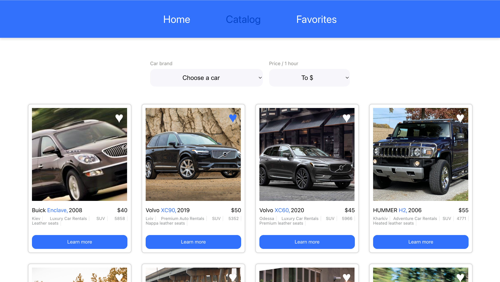

# Car Rental Service

This project was created with
[Create React App](https://github.com/facebook/create-react-app). For
acquaintance and settings of additional features
[refer to documentation](https://facebook.github.io/create-react-app/docs/getting-started).

## Project Structure:

The app includes a catalog page and a favorite cars page.

- Сatalog: You can view our directory of vehicles available for rent. Our range
  ranges from compact cars to luxury SUVs, ensuring that there is something to
  suit all needs and preferences.
- Favorites: on this page you can see previously saved cars.

## Technologies

## Useful Links

- [Figma layout](https://www.figma.com/file/XhC8FSCfAkraEF5l7Hx4fL/Test?type=design&node-id=0-1&mode=design)
  :the layout on which the application was created;
- [mockAPI](https://mockapi.io/projects) :API Modeling Tool;
